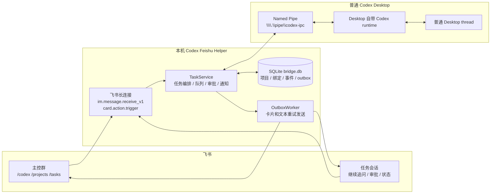
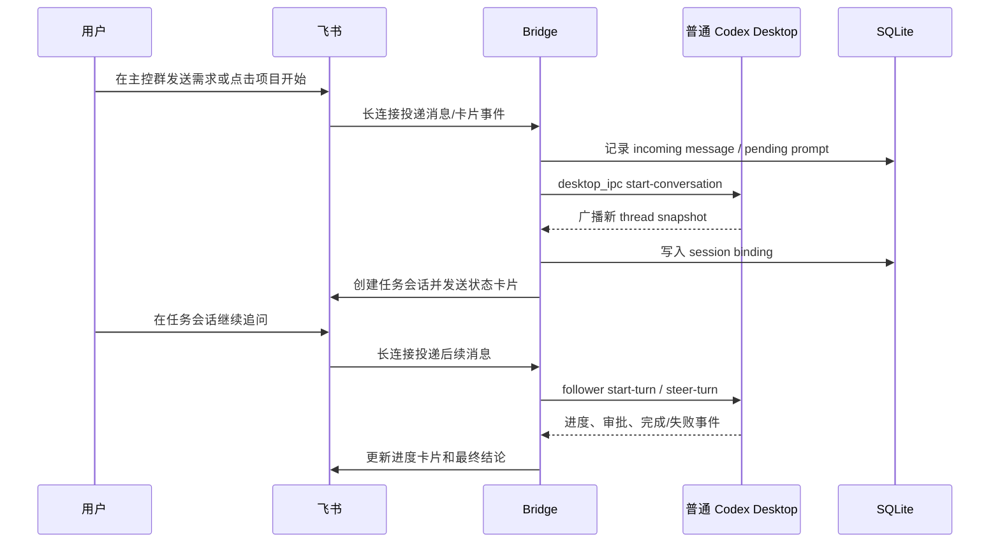
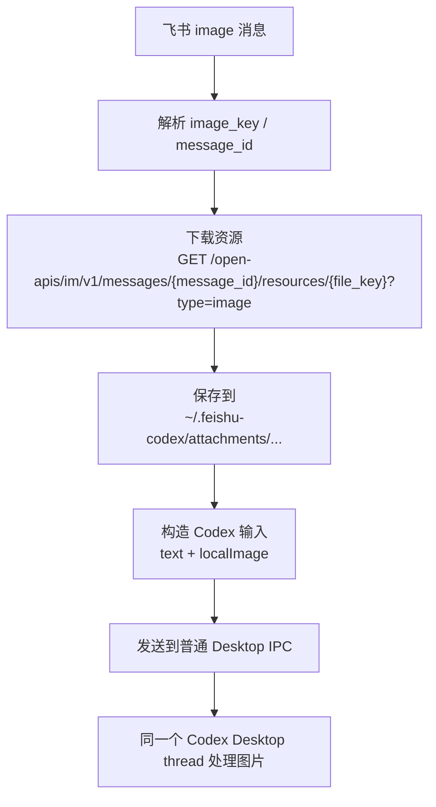

# Codex Feishu Helper

Codex Feishu Helper 是一个本地桥接服务，用飞书群聊控制本机正在运行的 Codex Desktop 对话。它适合个人把飞书当作 Codex 任务控制台：在主控群里选择项目、创建任务、查看任务列表，在每个任务的独立飞书会话里持续追问和接收进度、结论。

核心路线是 **desktop_ipc only**：bridge 只连接普通 Codex Desktop 暴露的本机 IPC 管道，不启动 helper 自己的 Codex runtime，也不要求补丁版 Desktop、canonical WebSocket 或代理共享启动。飞书发来的消息最终进入同一个普通 Desktop runtime，因此 Desktop 侧能看到真实 thread，飞书侧能继续控制同一个 thread。

当前默认设计是：

- 飞书事件默认走长连接，不要求公网 IP、域名或内网穿透。
- HTTP 服务默认只监听 `127.0.0.1`，用于健康检查、诊断和可选 HTTP 回调 fallback。
- 新任务默认创建独立飞书任务会话；如果没有建群权限，可回退为群内话题。
- Codex 默认模型是 `gpt-5.4`，思考等级是 `xhigh`，权限是 `danger-full-access`，审批策略是 `never`。
- 任务过程会推送结构化进度卡片，完成后推送结构化最终结论。
- 只在普通 Codex Desktop 里单独发起、没有绑定飞书的对话，结束后也会在主控群提醒，并可一键接管到飞书继续。

Codex Desktop 实时同步的长期优化方案见 [docs/CODEX_DESKTOP_SYNC_OPTIMIZATION.md](docs/CODEX_DESKTOP_SYNC_OPTIMIZATION.md)。

## 原理架构

整体上，项目由三个边界组成：飞书长连接负责接收用户输入，bridge 负责状态和编排，普通 Codex Desktop 负责真正执行任务。



### 新任务流程

用户在飞书发起任务后，bridge 不会创建第二套 Codex 服务。它会请求普通 Desktop 在同一个 IPC/runtime 下创建 thread，然后把这个 thread 和飞书任务会话绑定起来。



### 图片消息流程

飞书图片不会直接传给模型。bridge 先用飞书资源接口把图片下载到本机，再把本地文件路径作为 Codex Desktop 支持的 `localImage` 输入发送给同一个普通 Desktop thread。



## 能做什么 / 不做什么

能做：

- 在飞书主控群打开 Codex 控制台、查看项目、查看运行任务和历史任务。
- 从飞书创建普通 Codex Desktop thread，并在独立任务会话里持续追问。
- 接管已经在普通 Desktop 中存在的 thread。
- 把飞书图片消息下载到本机后作为 `localImage` 交给普通 Desktop thread。
- 把审批、队列、进度、失败、完成结论以飞书卡片/消息形式回传。

不做：

- 不启动 helper-owned Codex runtime。
- 不要求补丁版 Codex Desktop。
- 不使用 canonical WebSocket 或 SOCKS 代理作为主线。
- 不把本机 HTTP 管理接口暴露到公网。
- 不承诺多人团队权限隔离；当前定位是个人本机控制台。

## 功能概览

- `/codex`：打开主控台。
- 项目列表：自动/配置导入本地项目后，从主控台选择项目。
- 新建任务：在项目下创建 Codex 任务，并创建独立飞书任务会话。
- 继续任务：在任务会话里直接发消息即可继续同一个 Codex 线程。
- 任务列表：查看运行中、已完成、失败、中断、归档任务。
- 任务设置：在飞书中查看和调整模型、思考等级。
- Codex Desktop 单独对话提醒：后台扫描最近结束的未绑定本机 Codex 对话，完成/失败/中断后推送到主控群。
- 诊断恢复：检查飞书权限、长连接、Codex Desktop IPC、数据库、消息 outbox。
- 本地守护：Windows 定时任务可每 5 分钟检查并拉起桥接服务。

## 环境要求

- Windows 10/11、macOS 或 Linux。当前脚本优先支持 Windows。
- Node.js 22.13 或更高版本。
- 已安装并登录 Codex CLI：`codex --version` 能正常输出，且 `codex login` 已完成。
- 一个飞书自建应用，已启用机器人和长连接事件订阅。

安装 Codex CLI 后先在本机完成登录：

```powershell
codex login
codex --version
```

## 快速启动

Windows 推荐走一次初始化，后面都用桌面入口：

如果你是下载 ZIP 或已经拿到仓库目录，直接双击根目录的 `Install Codex Feishu Helper.cmd` 即可。

```powershell
git clone https://github.com/a1647517212/codex-feishu-helper.git
cd codex-feishu-helper
powershell -ExecutionPolicy Bypass -File .\scripts\setup-windows.ps1
```

脚本会完成：

- 检查 Node.js 和 Codex CLI。
- 安装 npm 依赖。
- 构建项目。
- 创建用户配置目录 `%USERPROFILE%\.feishu-codex`。
- 如果配置不存在，复制 `config.example.json` 为 `%USERPROFILE%\.feishu-codex\config.json`。
- 在桌面创建 `Codex Feishu Helper` 控制面板快捷方式。

日常使用不需要记命令，直接双击桌面的 `Codex Feishu Helper`：

| 按钮 | 用途 |
| --- | --- |
| `Setup / Repair` | 重新检查依赖、构建项目、修复桌面快捷方式 |
| `Open Config` | 打开 `%USERPROFILE%\.feishu-codex\config.json` |
| `Start Bridge` | 后台启动飞书桥接服务 |
| `Install Watchdog` | 安装 5 分钟一次的后台保活任务 |
| `Refresh` | 刷新配置、构建产物、bridge、Desktop IPC、Desktop 进程状态 |

仓库根目录也提供了两个可双击入口：

- `Install Codex Feishu Helper.cmd`：首次安装或修复。
- `Codex Feishu Helper.cmd`：打开控制面板。

首次使用时，在控制面板点 `Open Config`，填写配置：

```powershell
notepad $env:USERPROFILE\.feishu-codex\config.json
```

至少需要填写：

- `feishu.appId`
- `feishu.appSecret`
- `feishu.defaultChatId`
- `server.adminToken`

`server.adminToken` 是本机 HTTP 诊断接口的访问 token，只在本机 `/doctor`、`/console-card` 等管理接口使用。可以填一个本机自用随机字符串，例如：

```json
{
  "server": {
    "adminToken": "change-this-local-token"
  }
}
```

最小可运行配置示例：

```json
{
  "server": {
    "host": "127.0.0.1",
    "port": 8787,
    "adminToken": "change-this-local-token"
  },
  "feishu": {
    "appId": "cli_xxx",
    "appSecret": "xxx",
    "defaultChatId": "oc_xxx",
    "transport": "long_connection",
    "messageTransport": "long_connection",
    "cardActionTransport": "long_connection",
    "interactionMode": "hybrid",
    "taskContainerMode": "dedicated_chat",
    "allowedChatIds": ["oc_xxx"]
  }
}
```

如果你更习惯命令行，也可以手动启动服务：

```powershell
npm run start
```

检查诊断：

```powershell
npm run doctor
```

启动成功后，日志通常能看到：

```text
codex desktop ipc transport ready
codex app workspace sync completed
feishu long connection ready
```

然后在飞书主控群发送：

```text
/codex
```

如果一切正常，机器人会回复 `Codex 控制台` 卡片。点击 `项目` 应能看到当前普通 Codex Desktop 已记录的 active 工作区。

### 普通 Desktop IPC 模式

现在优先使用 `desktop_ipc` 连接普通正在运行的 Codex Desktop：

```json
{
  "codex": {
    "connectionMode": "desktop_ipc",
    "desktopIpcPipePath": "\\\\.\\pipe\\codex-ipc",
    "desktopIpcInitialSnapshotWaitMs": 1500
  }
}
```

该模式只连接普通 Desktop 自带的 `\\\\.\\pipe\\codex-ipc`，不会额外拉起独立 runtime。飞书侧可通过 `/tasks` 接管 Desktop 已打开的 thread；新任务选择项目后，bridge 通过 Desktop IPC host request `start-conversation` 请求普通 Desktop 创建新 thread，等待同一个 Desktop IPC pipe 广播包含同一 prompt 的新 thread snapshot，再绑定到该 Desktop owner client。后续继续 turn、steer、interrupt、设置模型/思考等级同样都走 Desktop owner IPC。

使用顺序：

1. 先打开普通 Codex Desktop。
2. 启动 bridge：控制面板点 `Start Bridge`，或运行 `npm run start`。
3. 在飞书主控群直接发送任务并选择项目，bridge 会在普通 Desktop 创建新 thread；也可以发送 `/tasks` 查看可接管线程，或发送 `/claim <threadId>` 绑定到飞书继续。

工作区来源：

- bridge 启动时会读取普通 Codex Desktop 的工作区状态并导入为项目。
- `/codex -> 项目` 会先再次同步工作区，再展示 active 项目。
- 已归档项目不会出现在项目列表里；未归类 Desktop thread 可以通过 `/unclassified` 归入项目。

如果桌面快捷方式被删，可以重新创建：


```powershell
npm run shortcuts
```

如果希望后台保活：

```powershell
npm run watchdog
```

## 飞书应用配置

完整配置步骤见 [docs/FEISHU_APP_SETUP.md](docs/FEISHU_APP_SETUP.md)。

最小流程：

1. 在飞书开放平台创建企业自建应用。
2. 启用机器人，并把机器人拉入主控群。
3. 在「事件订阅」里启用长连接。
4. 订阅消息事件 `im.message.receive_v1`。
5. 订阅卡片按钮事件 `card.action.trigger`，优先选择长连接。
6. 授权机器人读取群内所有消息，这样群里不需要 `@` 机器人。
7. 授权发送消息、回复消息、发送卡片、创建群聊、更新群聊等权限。默认一任务一独立会话模式必须有创建群聊权限。
8. 发布应用版本，并在管理后台完成授权。

默认模式是 `taskContainerMode=dedicated_chat`，也就是每个 Codex 任务创建一个独立飞书群聊。这个模式不是只在主控群里回复消息，所以「创建群聊」是必选权限。

默认必选权限清单：

| 场景 | 权限 |
| --- | --- |
| 接收群消息 | 事件 `im.message.receive_v1`，以及控制台提示的消息读取权限 |
| 读取不用 @ 的群消息 | 机器人接收群聊全部消息能力 |
| 发送文本/卡片、回复消息、更新卡片 | `im:message:send_as_bot`、`im:message` |
| 创建每个任务的独立飞书群聊 | `im:chat`、`im:chat:create` |
| 修改任务群标题、诊断/切换话题模式 | `im:chat`、`im:chat:update` |
| 读取主控群和任务群信息 | `im:chat:readonly` 或 `im:chat:read` |
| 卡片按钮点击 | 事件 `card.action.trigger`，优先选择长连接 |
| 长连接事件 | 事件订阅长连接，不需要公网回调地址 |

可选权限：

| 场景 | 权限 |
| --- | --- |
| 自动检查/修复应用回调配置 | `admin:app.info:readonly` 或 `application:application:self_manage` |
| 后续把更多用户或机器人拉入已有任务群 | `im:chat.members:write_only` |
| 图片消息转给普通 Codex Desktop | 消息读取相关权限，以及资源下载权限 `im:resource` |

不同租户控制台显示的权限名称可能略有差异，以飞书开放平台实际提示为准。

当前图片消息处理方式：

- 飞书里的 `image` 消息会先通过 `GET /open-apis/im/v1/messages/{message_id}/resources/{file_key}?type=image` 下载到本机 `storage.homeDir/attachments/...`。
- Bridge 随后把这张本地图片作为 `localImage` 输入发给当前正在运行的普通 Codex Desktop runtime，不会启动单独 runtime，也不会切到别的传输主线。
- 纯图片消息也可以直接创建新任务；如果没有文字说明，bridge 会用默认提示词 `请查看这张图片。`

如果不想给机器人创建群权限，可以改成主控群内话题 fallback：

```json
{
  "feishu": {
    "taskContainerMode": "topic",
    "taskChatFallbackToTopic": true
  }
}
```

这个模式不创建独立任务群，但任务不会出现在飞书左侧会话列表里，只会作为主控群内话题/回复存在。

## 配置文件

默认配置路径：

```text
%USERPROFILE%\.feishu-codex\config.json
```

可以通过环境变量或参数指定：

```powershell
$env:FEISHU_CODEX_CONFIG="D:\path\config.json"
npm run start

node dist/src/main.js serve --config D:\path\config.json
```

配置模板见 [config.example.json](config.example.json)。

如果直接使用模板里的 `${FEISHU_CODEX_ADMIN_TOKEN}` 但没有设置环境变量，bridge 会在每次启动时生成临时 token。建议正式使用时在 `config.json` 里写固定 `server.adminToken`，这样诊断接口和后台守护更稳定。

默认会扫描普通 Codex Desktop 最近 24 小时内结束、但还没有绑定飞书的本机对话，并向 `feishu.defaultChatId` 推送一次提醒。提醒卡片包含摘要和 `[在飞书继续]`、`[查看摘要]`、`[忽略]` 操作；同一个 turn 会用 outbox 去重，不会反复提醒。

相关配置：

```json
{
  "bridge": {
    "codexOnlyCompletionWatchEnabled": true,
    "codexOnlyCompletionPollMs": 60000,
    "codexOnlyCompletionLookbackMs": 86400000
  }
}
```

不要把真实 `appSecret`、`adminToken`、数据库、日志提交到仓库。`.gitignore` 已默认忽略 `.env`、本地日志、`dist`、`node_modules` 和 `.feishu-codex`。

## 常用命令

在飞书主控群里：

- `/codex`：主控台。
- `/doctor`：诊断。
- `/tasks`：最近任务。
- `/projects`：项目列表。
- `/claim <threadId>`：绑定已有 Codex 线程。

在任务会话里：

- 直接发消息：继续当前任务。
- `/status`：查看状态。
- `/queue`：查看队列。
- `/stop`：停止当前任务。
- `/retry`：重试失败任务。
- `/archive`：归档任务。

## 常见问题

### `/codex` 没有反应

先确认 bridge 进程还在：

```powershell
Get-CimInstance Win32_Process | Where-Object { $_.CommandLine -match 'dist/src/main.js serve' }
```

再看日志：

```powershell
Get-Content $env:USERPROFILE\.feishu-codex\bridge.log -Tail 80
```

正常应该有 `feishu long connection ready`。如果没有，重新启动 bridge 或使用控制面板的 `Start Bridge`。

### 项目列表不全

项目列表只展示 `active` 项目，不展示归档项目。bridge 会从普通 Codex Desktop 工作区状态同步 active 项目；如果刚在 Desktop 新开了工作区，重新发送 `/codex` 并点击 `项目` 会触发一次同步。

### 图片消息失败

图片链路需要飞书资源下载权限。日志里如果出现 `Feishu download message resource failed`，通常是飞书应用缺少资源下载相关 scope，或应用版本没有重新发布授权。正常成功日志包括：

```text
feishu message received ... attachments: 1
Feishu download message resource saved
codex image attachments prepared
```

### 任务失败但图片已经收到

如果日志显示图片已保存并准备为 `localImage`，失败通常已经进入 Codex runtime 层。例如模型网关返回额度不足、网络错误或 Desktop runtime 错误。此时图片桥接本身是通的，应优先看 `task.failed` 事件里的 runtime error。

### 卡片按钮点击失败

优先使用长连接 `card.action.trigger`。如果飞书端没有把卡片事件投到本地，按钮可能出现 toast 错误。可临时改成命令模式：

```json
{
  "feishu": {
    "interactionMode": "message_command"
  }
}
```

命令模式下卡片会显示对应文本命令，不依赖公网 HTTP callback。

## 本地 HTTP 服务说明

默认不需要公网地址。HTTP 只用于：

- `GET /healthz`
- `GET /doctor`
- `POST /feishu/events`，仅 HTTP callback fallback 使用。
- `POST /feishu/card`，仅 HTTP card callback fallback 使用。

如果飞书租户无法把卡片按钮事件配置成长连接，可以临时改成命令模式：

```json
{
  "feishu": {
    "interactionMode": "message_command",
    "cardActionTransport": "long_connection"
  }
}
```

或者自行部署公网 relay，只暴露 `/feishu/card`。

## 开发

```powershell
npm install
npm run build
npm test
npm run check
```

生成 Codex 协议 schema：

```powershell
npm run generate:codex-schema
```

## 安全边界

- 个人使用优先，默认不做复杂团队权限模型。
- 建议只在自己的私有主控群中使用。
- 不要把 bridge 管理接口暴露到公网。
- 默认 `danger-full-access` 和 `approvalPolicy=never` 意味着 Codex 可以直接操作本机文件和命令，请只在可信环境使用。
- `allowedUserIds` / `allowedChatIds` 为空数组或 `["*"]` 时允许所有飞书用户/群；要收紧访问时再改成具体 ID。

## 开源文档

- [飞书应用配置](docs/FEISHU_APP_SETUP.md)
- [开源发布检查清单](docs/OPEN_SOURCE_RELEASE.md)
- [Codex Desktop 同步优化方案](docs/CODEX_DESKTOP_SYNC_OPTIMIZATION.md)
- [当前功能覆盖](docs/FULL_DESIGN_COVERAGE.md)
- [用户体验优化计划](docs/UX_OPTIMIZATION_PLAN.md)

## 许可证

GPL-3.0-only。详见 [LICENSE](LICENSE)。
