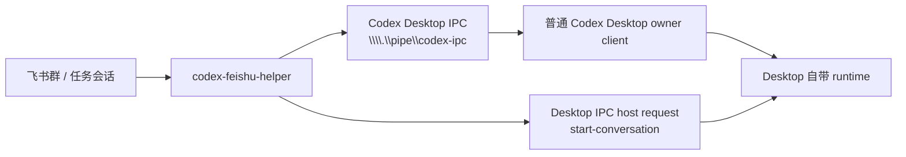

# Codex Desktop 实时同步优化方案

## 目标

飞书控制的必须是普通 Codex Desktop 正在使用的同一套 runtime。当前主线只保留 `desktop_ipc`：bridge 连接官方 Desktop 暴露的 `\\\\.\\pipe\\codex-ipc`，监听 Desktop thread snapshot，并把 follower 请求定向到 Desktop owner client。

已明确废弃的路线：

- helper 自己启动网络监听 app-server。
- 通过环境变量让 Desktop 连接非普通 Desktop 的运行时。
- 本机代理转发 Desktop 网络连接。
- 复制或修改 Codex Desktop 安装包。
- 为上述路线保留启动脚本、配置项、测试或文档入口。

## 当前架构



## 已实测结论

- Desktop 会广播 `thread-stream-state-changed`，其中 `sourceClientId` 是该 thread 的 Desktop owner。
- bridge 维护 snapshot 列表，用于 `/tasks`、`/claim` 和任务完成提醒。
- follower 请求需要设置 `targetClientId=<Desktop owner sourceClientId>`。
- `thread-follower-set-model-and-reasoning` 已实测返回 `{ ok: true }`，且 `handledByClientId` 指向 Desktop owner。
- bridge 运行在 `desktop_ipc` 时不会启动独立 runtime；飞书新任务入口通过 Desktop IPC host request `start-conversation` 让普通 Desktop 创建新 thread，等待同一条 IPC pipe 的 `thread-stream-state-changed` owner snapshot，且只有 snapshot 包含同一 prompt 时才完成绑定，后续再用 follower IPC 控制该 Desktop owner。

## 配置

```json
{
  "codex": {
    "connectionMode": "desktop_ipc",
    "desktopIpcPipePath": "\\\\.\\pipe\\codex-ipc",
    "desktopIpcInitialSnapshotWaitMs": 1500
  }
}
```

`desktop_ipc` 是当前唯一保留的连接模式。bridge 不再保留任何非 Desktop 同 runtime fallback。

## 行为边界

- 支持飞书创建新的普通 Desktop thread：通过 Desktop IPC host request `start-conversation` 请求普通 Desktop 创建 thread，用 prompt 匹配 Desktop IPC snapshot 后绑定新 thread，再通过 Desktop owner follower IPC 继续控制。
- 支持接管和继续普通 Desktop 已打开的 thread。
- 支持从 Desktop snapshot 合成 Feishu 侧状态、完成提醒和结果投影。
- 支持通过 follower IPC 继续 turn、追加 steer、interrupt，以及设置模型/思考等级。
- 新建 thread 通过普通 Desktop 的 IPC host request + prompt-matched snapshot + owner follower IPC 完成，不走独立 runtime。
- 不支持 Desktop thread 重命名同步；当前 IPC surface 尚未确认稳定接口。

## 验收标准

- 进程列表中只有普通 Desktop 自己的 runtime，不出现 bridge 另起的独立 runtime。
- bridge 日志出现 `codex desktop ipc transport ready`。
- `/doctor` 显示 `Codex连接：Desktop IPC / 普通 Desktop IPC`，并显示 Desktop IPC pipe 和 observed thread 数。
- 飞书新任务选项目后，普通 Desktop 出现新 thread，bridge 只绑定包含同一 prompt 的新 Desktop snapshot，且进程列表不出现额外独立 runtime。
- 飞书 `/tasks` 能看到普通 Desktop 当前 thread。
- 飞书 `/claim <threadId>` 后继续发送消息，Desktop owner 能处理 follower 请求。

## 后续优先级

1. 完善 Desktop IPC 事件到 Feishu projection 的补偿同步。
2. 为 Desktop IPC 增加更多失败诊断，例如 pipe 不存在、没有 Desktop owner、snapshot 超时或 prompt 不匹配。
3. 持续跟踪 Desktop IPC host request 的参数和响应字段，保持 `start-conversation` 路径与普通 Desktop 版本兼容。
4. 继续完善 `/tasks`、`/claim` 和新任务失败恢复提示。
