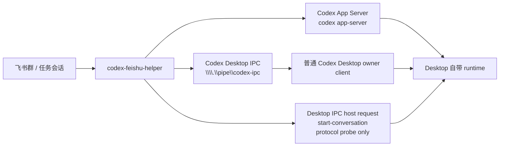

# Codex Desktop 实时同步优化方案

## 目标

飞书控制的必须是普通 Codex Desktop 正在使用的同一套 runtime。当前主线是：

- `desktop_proxy`：沿用旧模式名，但当前实际通过官方 direct `codex app-server` stdio 连接普通 Desktop，并承担飞书入口的新线程创建、thread title 和 turn 控制。thread goal 不由 bridge 自动设置，只由 Codex 官方 `/goal` 指令或其它显式 goal 操作触发。
- `desktop_ipc`：连接官方 Desktop 暴露的 `\\\\.\\pipe\\codex-ipc`，承担已打开线程观测、接管和 follower 控制。
- 当配置显式要求 `desktop_proxy`，但当前机器的 direct `codex app-server` 链路仍不可用时，bridge 会在 transport 层降级到 `desktop_ipc`，确保接管已有线程的控制台功能不因为 app-server 失联而直接崩溃。

已明确废弃的路线：

- helper 自己启动网络监听 app-server。
- 通过环境变量让 Desktop 连接非普通 Desktop 的运行时。
- 本机代理转发 Desktop 网络连接。
- 复制或修改 Codex Desktop 安装包。
- 为上述路线保留启动脚本、配置项、测试或文档入口。

## 当前架构



## 已实测结论

- Desktop 会广播 `thread-stream-state-changed`，其中 `sourceClientId` 是该 thread 的 Desktop owner。
- bridge 维护 snapshot 列表，用于 `/tasks`、`/claim` 和任务完成提醒。
- follower 请求需要设置 `targetClientId=<Desktop owner sourceClientId>`。
- `thread-follower-set-model-and-reasoning` 已实测返回 `{ ok: true }`，且 `handledByClientId` 指向 Desktop owner。
- 官方 app-server 文档已提供 `thread/start`、`turn/start`、`turn/steer`、`thread/name/set`，以及实验性 `thread/goal/set|get|clear`；其中 thread goal 需要 `initialize.capabilities.experimentalApi=true`。
- 底层 `DesktopIpcClient` 仍保留 `start-conversation` / `thread/start` 协议探针，用于验证普通 Desktop 运行态暴露了什么能力。
- 但产品层不再依赖这些探针来承诺“飞书可直接新建线程”。当 bridge 运行在 `desktop_ipc` 时，新任务入口会保留飞书草稿并提示 `/tasks` 接管已有线程，后续继续控制仍走 follower IPC。
- 在当前这台 Windows 机器上，live probe 已验证：direct `codex app-server` 本身就能创建真实 thread，并可在 experimental API 下写入 goal。
- 当 `desktop_proxy` 不可用时，bridge 会自动降级并继续连接 `\\\\.\\pipe\\codex-ipc`；但 stock Desktop 运行态对 `start-conversation` / `thread/start` 仍会返回 `no-client-found`，因此 `desktop_ipc` 仍然只是 claim/continue 路线。

## 配置

```json
{
  "codex": {
    "connectionMode": "desktop_ipc",
    "desktopIpcPipePath": "\\\\.\\pipe\\codex-ipc",
    "desktopIpcInitialSnapshotWaitMs": 1500
  }
}
```

建议优先把 `connectionMode` 配成 `desktop_proxy`；如果当前机器的 direct `codex app-server` 仍不可用，再切回 `desktop_ipc` 兼容模式。

## 行为边界

- 支持飞书创建新的普通 Desktop thread：仅在官方 `desktop_proxy` 可用时，通过 `thread/start` 创建，并同步 thread title；普通飞书消息不会自动写成 thread goal。
- 支持接管和继续普通 Desktop 已打开的 thread。
- 支持从 Desktop snapshot 合成 Feishu 侧状态、完成提醒和结果投影。
- 支持通过 follower IPC 继续 turn、追加 steer、interrupt，以及设置模型/思考等级。
- `desktop_ipc` 产品面只支持接管和继续已有线程；低层 `start-conversation` / `thread/start` 探针不视为当前受支持的飞书新建线程路径。
- 新建 thread 通过普通 Desktop 官方 direct `codex app-server` 完成，不走独立 runtime。
- `desktop_proxy` 支持 thread 重命名，并保留显式 goal API 能力；`desktop_ipc` 下的 rename/goal 仍受当前 IPC surface 限制。

## 验收标准

- 进程列表中只有普通 Desktop 自己的 runtime，不出现 bridge 另起的独立 runtime。
- bridge 日志优先出现 `codex desktop proxy transport ready`；若当前机器未能直连 `codex app-server`，则至少要明确诊断出 app-server 不可用原因。
- `/doctor` 显示当前 `Desktop Proxy` 或 `Desktop IPC` 的真实连接状态。
- 飞书新任务选项目后，如果 `desktop_proxy` 可用，则出现真实新 thread 且普通消息不会自动进入 goal 模式；只有用户发送 Codex 官方 `/goal ...` 指令或其它显式 goal 操作时才进入 goal。若 direct app-server 当前不可用，飞书任务会回退为可重试草稿，不产生假线程绑定。
- 飞书 `/tasks` 能看到普通 Desktop 当前 thread。
- 飞书 `/claim <threadId>` 后继续发送消息，Desktop owner 能处理 follower 请求。

## 后续优先级

1. 完善 Desktop Proxy 事件到 Feishu projection 的补偿同步。
2. 为 Desktop Proxy 增加更明确的 direct app-server 启动诊断，例如 `codex app-server` 启动失败、实验 API 失配或 CLI 不可执行。
3. 持续跟踪 Desktop IPC host request 的参数和响应字段，但仅把它们当成协议观测，不把它们重新包装成当前产品承诺。
4. 继续完善 `/tasks`、`/claim` 和新任务失败恢复提示。
