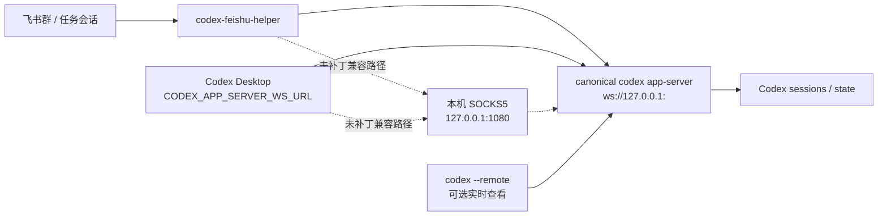

# Codex Desktop 实时同步优化方案

## 背景

飞书 bridge 在任务会话中继续 Codex 对话时，Codex App 有时不会实时刷新；重启 Codex App 后又能看到已完成内容。用户提出过“定时刷新 Codex App UI”的想法，但这种方式只是重新读取落盘历史，不能保证进行中状态、子 agent、审批和流式输出一致。

本方案记录源码和社区调查后的推荐优化路径，便于后续按优先级落地。

## 已确认根因

当前 bridge 的连接模式是：

1. `connectionMode=auto` 时先尝试 `codex app-server proxy`。
2. 如果无法连接 Desktop control socket，则回退到 `codex app-server` standalone stdio。

本机日志显示：

```text
failed to connect to socket at %USERPROFILE%\.codex\app-server-control\app-server-control.sock
os error 10050
codex app-server connected mode=standalone
```

同时本机 `app-server-control.sock` 不存在。因此当前实际状态是：

- Codex Desktop 自己启动一个 stdio app-server。
- Feishu bridge 又启动一个 standalone app-server。
- 两边只共享部分落盘历史，不共享同一个实时内存态。

这会导致 Desktop UI 不能稳定实时显示 bridge 发起的 turn。

## 源码和社区调查结论

OpenAI Codex app-server 支持以下 transport：

- `stdio://`
- `unix://`
- `ws://IP:PORT`
- `off`

`codex --remote ws://host:port` 可以让 TUI 连接远程 app-server。Codex Desktop 打包代码中也存在 `CODEX_APP_SERVER_WS_URL` 和 `CODEX_APP_SERVER_FORCE_CLI` 入口，说明 Desktop 内部存在 WebSocket app-server 连接路径。

2026-05-09 本机实测补充：

- `codex app-server --listen ws://127.0.0.1:<port>` 可作为 canonical WebSocket app-server。
- Node 22 原生 `WebSocket` 可完成 `initialize` / `initialized` / `thread/list`。
- 多个客户端可以同时连接同一个 app-server。
- Codex Desktop 26.506.2212.0 会读取 `CODEX_APP_SERVER_WS_URL`，但 WebSocket transport 硬编码通过 `socks5h://127.0.0.1:1080` 访问目标 URL。
- 当前项目已提供 Desktop WS 直连补丁：复制一份可写 Codex Desktop 到用户目录后，只补丁副本的 `app.asar`，把 WebSocket transport 的硬编码 SOCKS agent 改成直连。这样不破坏 WindowsApps 官方包。
- 因此推荐路径是安装直连补丁后让 Desktop 直接接入 bridge-owned app-server；不安装补丁时，仍可用本机 `127.0.0.1:1080` SOCKS5 代理作为兼容路径。

社区 issue 里也有相同方向的讨论：

- `openai/codex#11166`：希望把 app-server 暴露为更稳定的网络/socket transport，供第三方 UI 和桥接器使用。
- `openai/codex#15320`：多个客户端连接同一 app-server/thread 时，外部客户端发起的 turn 仍可能存在 UI 实时刷新边界。
- `openai/codex#15355`：希望给正在运行的交互会话提供稳定 ingress，避免键盘/PTY 注入。

结论：定时刷新 UI 不应作为主方案。正确方向是统一 runtime，并在 Feishu 侧做事件流和完成后补偿同步。

## 推荐架构



## 优化阶段

### P0：bridge 拥有 canonical app-server

新增连接模式：

```json
{
  "codex": {
    "connectionMode": "canonical_websocket",
    "websocketListenUrl": "ws://127.0.0.1:47931",
    "websocketAttachExisting": true,
    "desktopSocksProxyEnabled": false,
    "desktopSocksProxyHost": "127.0.0.1",
    "desktopSocksProxyPort": 1080
  }
}
```

行为：

- bridge 启动 `codex app-server --listen ws://127.0.0.1:<port>`。
- bridge 通过 WebSocket JSON-RPC 连接它。
- 如果 `websocketAttachExisting=true` 且该端口已有 ready app-server，bridge 直接接入现有服务，不再新启动 app-server。这样 bridge/watchdog 重启不会顺带中断 Codex Desktop 当前连接。
- 可选启动只允许转发到 canonical app-server 的本机 SOCKS5 代理。
- doctor 展示当前连接类型、URL、SOCKS5 代理状态。

### P1：让 Desktop 接入 canonical runtime

推荐先安装补丁版 Desktop 副本：

```powershell
npm run desktop:copy
```

安装行为：

- 自动定位当前 Codex Desktop 官方安装目录。
- 复制一份可写副本到 `%LOCALAPPDATA%\CodexFeishuHelper\CodexDesktopPatched`。
- 只把副本 `app.asar` 中硬编码的 `SocksProxyAgent("socks5h://127.0.0.1:1080")` 改成直连。
- 可通过 `npm run desktop:copy:remove` 删除补丁版副本。

注意：已经运行中的 Microsoft Store 版 Codex Desktop 不会自动切换到 bridge-owned app-server。必须通过 `Launch Shared Desktop` / `npm run desktop` 重启 Desktop，让它继承 `CODEX_APP_SERVER_WS_URL` 并使用补丁版副本，才是真正同一个 canonical app-server。

验证方式：

```powershell
$env:CODEX_APP_SERVER_WS_URL="ws://127.0.0.1:47891"
Start-Process "C:\Program Files\WindowsApps\OpenAI.Codex_...\app\Codex.exe"
```

或者通过 Windows 启动脚本给 Codex Desktop 注入环境变量。

注意：未安装补丁时，当前 Desktop 版本不是直连 `CODEX_APP_SERVER_WS_URL`，而是先连 `127.0.0.1:1080`。如果 1080 没有 SOCKS5 代理，Desktop 会连接失败；如果 1080 已被其他代理占用，需要确认该代理允许访问 `127.0.0.1:<canonical-port>`。

验收标准：

- Desktop 打开后连接同一个 app-server。
- Feishu 发起新 turn 时 Desktop 能收到 `turn/started`、`item/*`、`turn/completed`。
- Desktop 不再需要重启才能看到 bridge 写入的内容。

风险：

- `CODEX_APP_SERVER_WS_URL` 不是稳定公开 API。
- Desktop 仍可能过滤外部客户端发起的某些事件。
- 后续 Codex Desktop 更新可能改变隐藏入口。

### P2：Feishu 事件流和补偿同步

实时阶段：

- 消费 `turn/started`。
- 消费 `turn/plan/updated`。
- 消费 `item/started`。
- 消费 `item/agentMessage/delta`。
- 消费 `item/reasoning/summaryTextDelta`。
- 消费 `item/completed`。
- 消费 `turn/completed`。

完成阶段：

- 调用 `thread/read` 或 `thread/turns/list` 拉取完整 turn/items。
- 对比本地 projection。
- 修正漏事件、截断、子 agent 信息缺失。
- 只在卡片超限时补发“完整最终结论”或续卡片。

## 不推荐方案

### 定时刷新 Codex App UI

问题：

- 不能保证同一个 app-server runtime。
- 无法还原正在运行中的内存态。
- 子 agent、审批、工具调用和流式输出仍可能丢失。
- 依赖 Desktop UI 行为，版本更新后容易失效。

### 键盘/PTY 注入

问题：

- 容易和人工输入冲突。
- 不能可靠判断输入是否提交。
- 难以审计和恢复。
- 不适合后台 bridge 长期运行。

- [x] `CodexClient` 抽象 stdio 与 WebSocket transport。
- [x] 配置新增 `websocketUrl`、`websocketListenUrl` 与 Desktop SOCKS5 代理选项。
- [x] 启动 canonical app-server 并检查 `/readyz`。
- [x] doctor 展示 app-server transport、WebSocket URL 和 SOCKS5 代理状态。
- [x] 增加 WebSocket transport mock 测试。
- [x] 验证 `CODEX_APP_SERVER_WS_URL` 启动 Desktop 的可行性，并确认当前版本未补丁时需要 `127.0.0.1:1080` SOCKS5 代理。
- [x] 增加可回滚的 Codex Desktop WS 直连补丁，补丁后 Desktop 不再要求 SOCKS 代理。
- [ ] 增加完成后 `thread/read` 补偿同步。
- [ ] 文档化 Desktop/TUI 接入方式。
